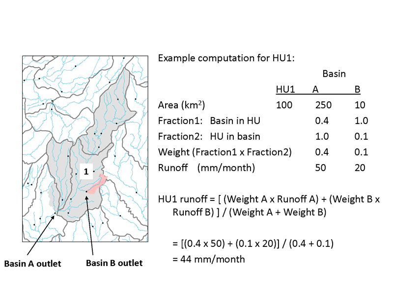

Calculations Quick-Reference
============================

A quick-reference guide to the common types of calculations performed within the ``hyswap`` package is provided below. See the :doc:`Glossary </meta/glossary>` section for definitions of specific terms. Also, refer to the :doc:`API Reference </reference/index>` section for more detailed documentation on specific functions within ``hyswap``. 

Assumptions and Caveats
-----------------------
The ``hyswap`` package functions assume that provided streamflow data has been quality controlled. No checks on incorrect, missing, or negative values are performed. Users should perform any necessary QA/QC checks on the data prior to using ``hyswap`` functions. Additionally, ``hyswap`` does not detect artifacts or shifts in streamflow data that potentially violate statistical methods, such as:
- negative flows associated with tidal-influenced locations or other phenomena
- regulated flows or transitions from regulated to unregulated flows (or vice versa)
- major watershed changes

For users who are applying ``hyswap`` functions directly to data retrieved from USGS NWIS, please be aware that non-standard parameter names occasionally occur. Reasons for this could be to indicate that a site has an upstream and downstream sensor, a sensor was moved in the water column, or a site was measured multiple times. This package treats sites with non-standard parameter names as outliers and skips those sites. Users should take appropriate steps to check for non-standard parameter names and determine appropriate data handling steps based on their needs.

Streamflow Percentiles
----------------------

Streamflow percentiles are a core calculation of ``hyswap`` that are used to determine streamflow conditions (e.g., normal, high-flow, low-flow, drought, flood). Percentiles can be computed from daily streamflow (discharge), *n*-day average streamflow, or runoff. Multiple types of percentiles are used in hydrologic analysis and vary in what subset of observations are used in calculating a given set of percentiles. Percentiles are closely related to exceedance probabilities used to construct flow duration curves (see below). The ``hyswap`` package provides support for the following types of streamflow percentiles:

+---------------------------+-------------------------------------------+
| Percentile Type           | Description                               |
+===========================+===========================================+
| Variable (Day of Year)    | Computed using flow observations for that |
|                           | day from all years of record resulting    |
|                           | in percentile classes/thresholds that     |
|                           | change seasonally and correspond to a     |
|                           | specific day of year. Variable percentiles|
|                           | are useful for characterizing flow        |
|                           | conditions relative to the typical flow   |
|                           | on a given day of the year. The variable  |
|                           | (day of year) percentile is the standard  |
|                           | percentile that is displayed in USGS      |
|                           | water data services.                      |
+---------------------------+-------------------------------------------+
| Fixed (All days)          | Computed using all flow observations in   | 
|                           | the period of record. Records from all    |
|                           | days of the year are combined resulting   |
|                           | in percentile classes/thresholds that do  |
|                           | not change seasonally. Fixed percentiles  |
|                           | are useful for characterizing flow        |
|                           | conditions relative to non-moving         |
|                           | phenomena such as flood stages or dam     |
|                           | intakes.                                  |
+---------------------------+-------------------------------------------+
| Variable Moving Window    | Computed using flow observations for that |
| (Day of Year)             | day plus or minus *n* number of days      |
|                           | (e.g., 7, 14, or 30) from all years of    |
|                           | record resulting in percentile            |
|                           | classes/thresholds that change seasonally |
|                           | and correspond to a specific day of year. |
|                           | Variable moving window percentiles reduce |
|                           | the fluctuation in percentile classes from|
|                           | day-to-day, especially for sites with     |
|                           | short observation records. Variable       |
|                           | moving window is useful for               |
|                           | characterizing flow conditions relative to|
|                           | typical flow expected on a given day of   |
|                           | the year.                                 |
+---------------------------+-------------------------------------------+

By default, ``hyswap`` computes streamflow percentiles using the unbiased Weibull plotting position formula, :math:`i/(n+1)`, where *i* is the rank of an observation and *n* is the sample size (Weibull, 1939). The Weibull formula has been the standard approach used by hydrologists for generating flow-duration and flood-frequency curves `(Helsel and others, 2020)`_. Weibull plotting position does not set values to either 0 or 100, recognizing the existence of a non-zero probablity of exceeding the maximum or minimum observed value. For further discussion of plotting positions refer to `(Helsel and others, 2020)`_.

``hyswap`` uses the ``numpy.percentile()`` implementation of the Weibull method (Type 6) for calculating percentiles. Additional methods of computing percentiles that exist in the ``numpy.percentile()`` function can be used in ``hyswap``. Users can refer to the `numpy function documentation <https://numpy.org/doc/stable/reference/generated/numpy.percentile.html>`_ for additional details.

Other default settings for percentile calculations are that NA values are dropped, a minimum of 10 years of record length is available for a given day of year, and percentile levels of 0, 5, 10, 25, 50, 75, 90, 95, 100 are calculated.

``hyswap`` uses the ``numpy.percentile()`` implementation of the Weibull method (Type 6) for calculating percentiles

Exceedance Probabilities and Flow-Duration Curves
^^^^^^^^^^^^^^^^^^^^^^^^^^^^^^^^^^^^^^^^^^^^^^^^^

In some hydrological studies, particularly those related to floods, a variation of the percentile known as the "percent exceedance" is used. It can be obtained by subtracting the percentile scale value from 100 percent.  For example, a discharge at the 75th percentile is the same as a discharge at the 25th percent exceedance (100-75=25). By default, ``hyswap`` computes streamflow exceedance probabilities using the unbiased Weibull plotting position formula (Weibull, 1939). Additional methods of computing exceedance probabilities can be used in ``hyswap`` including linear (R Type 4), Hazen (R Type 5), Gumbel (R Type 7), Reiss (R Type 8), and Blom (R Type 9). Flow-duration curves computed within ``hyswap`` are cumulative frequency curves where values indicate either (1) the percent of values equal to or less than each discharge value (percentile) OR (2) the percent of values equal to or greater than each discharge value (percent exceedance). The Weibull method of computing exceedance probabilities is used by default for computing flow-duration curves.

Flow Categorization
^^^^^^^^^^^^^^^^^^^
Streamflow observations at a streamgage can be assigned a flow condition category using ``hyswap`` by use of the `hyswap` :obj:`hyswap.utils.categorize_flows` function. Streamflow percentiles or interpolated estimated streamflow percentiles are compared to a categorization schema. Multiple categorization schema are available in ``hyswap`` with the default being flow categories similar to those displayed on the USGS National Water Dashboard. Categorization schema are applicable to both variable and fixed percentile types. Available schema are described below:

* "NWD" -- Categorization schema similar to the USGS National Water Dashboard, *default*
  Categorizes streamflow across all range of possible streamflow magnitudes. Typically used with variable percentiles

  .. image:: ../reference/nwd.png
    :width: 800
    :alt: Categorization schema of percentile ranges, labels, and color palette similar to the National Water Dashboard. 

* "WaterWatch" -- Categorization schema similar to the USGS WaterWatch website
  Categorizes streamflow across all range of possible streamflow magnitudes. Typically used with variable percentiles

  .. image:: ../reference/waterwatch.png
    :width: 800
    :alt: Categorization schema of percentile ranges, labels, and color palette similar to USGS WaterWatch.

* "NIDIS_Drought" -- Categorization schema similar to the NIDIS U.S. Drought Monitor
  Categorizes streamflow across only low-flow conditions.

  .. image:: ../reference/nidis_drought.png
    :width: 800
    :alt: Categorization schema of percentile ranges, labels, and color palette similar to NIDIS U.S. Drought Monitor.

* "WaterWatch_Drought" -- Categorization schema similar to the USGS WaterWatch Drought Conditions
  Categorizes streamflow across only low-flow conditions. Typically used with variable percentiles

  .. image:: ../reference/waterwatch_drought.png
    :width: 800
    :alt: Categorization schema of percentile ranges, labels, and color palette similar to USGS WaterWatch Drought Conditions.

* "WaterWatch_Flood" -- Categorization schema similar to the USGS WaterWatch Flood Conditions
  Categorizes streamflow across only high-flow conditions. Typically used with fixed percentiles

  .. image:: ../reference/waterwatch_flood.png
    :width: 800
    :alt: Categorization schema of percentile ranges, labels, and color palette similar to USGS WaterWatch Flood Conditions.

* "WaterWatch_BrownBlue" -- Categorization schema similar to the USGS WaterWatch categories but with an alternative color palette
  Categorizes streamflow across all range of possible streamflow magnitudes. Typically used with variable percentiles
  
  .. image:: ../reference/waterwatch_brownblue.png
    :width: 800
    :alt: Categorization schema of percentile ranges and labels similar to USGS WaterWatch but with a brown-blue color palette.

Area-Based Runoff
-----------------

In addition to information on a per-streamgage basis, ``hyswap`` can generate water information at the regional scale through computation of area-based runoff calculations. Estimates of runoff for a given area (e.g., state or HUC2 region) are generated by combining streamflow data collected at USGS streamgages at the sub-basin HUC8 (8-digit hydrologic unit code or hydrologic cataloging unit) using a weighted average approach. Hydrologic cataloging units and associated 8-digit accounting numbers (HUC8s) are a widely used geographic framework for the conterminous United States (CONUS). Each unit defines a geographic area representing part or all of a surface drainage basin or a combination of drainage basins. Cataloging units subdivide larger accounting units (HUC6s), subregions (HUC4s) and regions (HUC2s) into smaller areas designated by the U.S. Water Resources Council and the USGS's National Water Data Network. Cataloging units range in size from 24 to 22,808 km\ :sup:`2` with a median value of 3,133 km\ :sup:`2` `(Jones and others, 2022)`_.

The calculation of area-based runoff in ``hyswap`` involves the steps described below and illustrated in an example in Figure 1:

1. Compute runoff values (flow per unit area) for each streamgage basin by dividing the average daily flow by the delineated drainage area. Drainage areas are an input to the ``streamflow_to_runoff`` function in ``hyswap`` to obtain runoff in units of millimeters per unit time (e.g. day, month, year).
2. Calculate runoff for each HUC8 unit that is in the area of interest (e.g., state or HUC2 region) using the runoff from multiple streamgages along with associated overlap between streamgage basins and the HUC8. This process is discussed in detail under the 'Workflow for Estimating Area-Based Runoff' section. The dataframe containing the proportion of HUC8 area in each streamgage basin and the proportion of streamgage basin area in each HUC8 for all HUC8s is an input to the ``calculate_geometric_runoff`` functions in ``hyswap`` functions. This intersection table must be created from spatial data layers describing HUC and streamgage drainage area boundaries (more info below).
3. Aggregate runoff from the individual HUC8s that are within the area of interest (e.g., state or HUC2 region).

Workflow for Associating Streamgages with HUC8s for Area-Based Runoff Calculations
^^^^^^^^^^^^^^^^^^^^^^^^^^^^^^^^^^^^^^^^^^^^^^^^^^^^^^^^^^^^^^^^^^^^^^^^^^^^^^^^^^

Spatial datasets describing the respective drainage basin boundaries of the streamgages and the boundaries of hydrologic cataloging units must be obtained that cover all areas of interest (e.g. CONUS). Geospatial boundaries of streamgages may be based on delineated gage drainage areas calculated using NHDPlus Version 1 data `(U.S. Geological Survey, 2011)`_ or determined via other watershed delineation approaches. HUC8 boundaries are contained within the `USGS Watershed Boundary Dataset (WBD) <https://www.usgs.gov/national-hydrography/watershed-boundary-dataset>`_. 

Each geospatial streamgage drainage basin boundary is overlain on a geospatial dataset of HUC8s (the polygons outlined in thick gray-brown lines in Figure 1 example) to determine the area of intersection within the two datasets. For each overlapping area of HUC8s and streamgage drainage basin boundaries, the fraction of the basin in the HUC8 and the fraction of the HUC8 in the basin are calculated. These fractions are then multiplied by each other to compute a weighting factor for each basin in the runoff calculation.

You can find an example intersection dataset between CONUS HUC8s and streamgage basins in the `hyswap-example-notebooks repository <https://code.usgs.gov/water/computational-tools/surface-water-work/hyswap-example-notebooks>`_. This intersection dataset was created using the `surface water geospatial data assembly repository <https://code.usgs.gov/water/computational-tools/surface-water-work/surface-water-geospatial-data-assembly>`_.

Workflow for Estimating Area-Based Runoff
^^^^^^^^^^^^^^^^^^^^^^^^^^^^^^^^^^^^^^^^^

After obtaining a table of intersecting HUC8s and streamgage basins, the next step of the analysis is to determine which streamgage basins should be used to calculate a weighted average of runoff values for each HUC8 over each unit of time (e.g. days, months, years). The weight for each streamgage basin-HUC intersection is the product of the proportion of the HUC8's area in the streamgage basin area and the proportion of the streamgage basin's area in the HUC8 area. ``hyswap`` offers two options for estimating runoff using streamgage basins that overlap the HUC8s: 

1. For each unit of time with runoff data at one or more streamgages whose basins intersect the HUC8, obtain a weighted average of all runoff values. 
2. If a HUC8 and a streamgage basin have near perfect overlap (e.g. the proportion of the HUC8's area in the basin is greater than 0.9 and the proportion of the basin's area in the HUC8 is greater than 0.9), simply use the runoff values from that streamgage basin. If perfect overlap does not exist, use a weighted average of runoff values from:
  (a) all streamgage basins *contained* by the HUC8, and 
  (b) the smallest streamgage basin that *contains* the HUC8 

Note that in cases where there is near perfect overlap for multiple streamgage basins and a HUC8, the streamgage basin-HUC8 intersection with the *highest* weight is used to estimate runoff. This is the same method used to determine the smallest streamgage basin that contains the HUC8: among all the streamgage basins that contain the HUC8 (in other words, the proportion of the HUC8's area in the streamgage basins is roughly 1), find the HUC8-streamgage basin intersection with the highest weight (which means the proportion of the streamgage basin's area in the HUC8 is the largest). See Figure 1 for an example of this workflow. Note that in Figure 1, 'Fraction#' is analogous to 'proportion of shape X's area in shape Y'.

Figure 1. Example computation for computation of runoff for a selected HUC unit. (The drainage area of basin A is shaded light gray and the drainage area of basin B is shaded pink. Note that drainage basin B is nested within drainage basin A). Figure from `(Brakebill and others, 2011)`_ In this figure, 'Fraction#' is analogous to 'proportion of shape X's area in shape Y'.

**Note:** Description of methods for area-based runoff computation is adapted from `USGS WaterWatch <https://pubs.usgs.gov/publication/fs20083031>`_.

Streamflow Record Similarity
^^^^^^^^^^^^^^^^^^^^^^^^^^^^

Identifying streamgages that are most similar or correlated is a common task when identifying potential streamgages to be used for estimating missing records or other hydrological modeling tasks. ``hyswap`` can compute the similarity of streamflow records using different similarity measures and plot these as a matrix. The available measures are:

+---------------------------+-------------------------------------------+
| Similarity Measure        | Description                               |
+===========================+===========================================+
| Pearson's *r* correlation | Commonly used measure of correlation that |
|                           | measures the linear association between   |
|                           | two datasets `(Helsel and others, 2020)`_.|
|                           | Calculation of Pearson's *r* correlation  |
|                           | on daily streamflow records or            |
|                           | log-transformed daily streamflow records  |
|                           | is often used to identify potential       |
|                           | index or reference streamgages            |
|                           | `(Yuan, 2013)`_.                          |
+---------------------------+-------------------------------------------+
| Wasserstein Distance      | A metric that measures the distance       |
|                           | between two distributions and in a        |
|                           | hydrological context measures the “effort”|
|                           | required to rearrange one distribution of |
|                           | water into the other. The Wasserstein     |
|                           | distance can be used to compare how       |
|                           | similar two hydrographs are to each other |
|                           | `(Magyar & Sambridge, 2023)`_.            |
+---------------------------+-------------------------------------------+
| Energy Distance           | A metric that measures the distance       |
|                           | between two distributions. The energy     |
|                           | is experimental in hydrology but has been |
|                           | used to identify similarity between time  |
|                           | series such electricity demand            |
|                           | `(Ziel, 2021)`_.                          |
+---------------------------+-------------------------------------------+

References
----------

Brakebill, J.W., D.M. Wolock, and S.E. Terziotti, 2011. Digital Hydrologic Networks Supporting Applications Related to Spatially Referenced Regression Modeling. Journal of the American Water Resources Association (JAWRA) 47(5):916-932. 

Helsel, D.R., Hirsch, R.M., Ryberg, K.R., Archfield, S.A., and Gilroy, E.J., 2020. Statistical methods in water resources: U.S. Geological Survey Techniques and Methods, book 4, chap. A3, 458 p., https://doi.org/10.3133/tm4a3. [Supersedes USGS Techniques of Water-Resources Investigations, book 4, chap. A3, version 1.1.]

Jones, K.A., Niknami, L.S., Buto, S.G., and Decker, D., 2022. Federal standards and procedures for the national Watershed Boundary Dataset (WBD) (5 ed.): U.S. Geological Survey Techniques and Methods 11-A3, 54 p., https://pubs.usgs.gov/tm/11/a3/.

Magyar, J.C. & Sambridge, M., 2023. Hydrological objective functions and ensemble averaging with the Wasserstein distance, Hydrol. Earth Syst. Sci., 27, 991–1010, https://doi.org/10.5194/hess-27-991-2023.

U.S. Geological Survey, 2011. USGS Streamgage NHDPlus Version 1 Basins 2011. Data Series [DS-719] `water.usgs.gov/lookup/getspatial?streamgagebasins <https://water.usgs.gov/lookup/getspatial?streamgagebasins>`_

U.S. Geological Survey, 2023. USGS water data for the Nation: U.S. Geological Survey National Water Information System database, accessed at https://dx.doi.org/10.5066/F7P55KJN.

Weibull, W., 1939. A statistical theory of strength of materials, Ingeniors Vetenskaps Akademien Handlinga, no. 153, 9. 17

Yuan, L.L., 2013. Using correlation of daily flows to identify index gauges for ungauged streams, Water Resour. Res., 49, https://doi.org/10.1002/wrcr.20070.

Ziel, F., 2021. The energy distance for ensemble and scenario reduction, Phil, Trans. R. Soc. A. 379: 20190431, https://doi.org/10.1098/rsta.2019.0431.

.. _(Brakebill and others, 2011): https://doi.org/10.1111/j.1752-1688.2011.00578.x
.. _(Helsel and others, 2020): https://doi.org/10.3133/tm4A3
.. _(Jones and others, 2022): https://doi.org/10.3133/tm11A3
.. _(Magyar & Sambridge, 2023): https://doi.org/10.5194/hess-27-991-2023
.. _(U.S. Geological Survey, 2011): https://water.usgs.gov/lookup/getspatial?streamgagebasins
.. _(U.S. Geological Survey, 2023): http://dx.doi.org/10.5066/F7P55KJN
.. _(Yuan, 2013): https://doi.org/10.1002/wrcr.20070
.. _(Ziel, 2021): https://doi.org/10.1098/rsta.2019.0431
