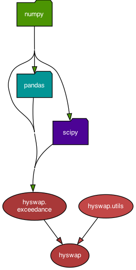

.. api:

=======================
Module Dependency Graph
=======================

Auto-generated module dependency graph for `hyswap` as generated by `pydeps`.

=============
API Reference
=============

Utility Functions
-----------------

.. automodule:: hyswap.utils
    :members:
    :special-members:

Exceedance Probability Functions
--------------------------------

.. automodule:: hyswap.exceedance
    :members:
    :special-members:

Raster Hydrograph Functions
---------------------------

.. automodule:: hyswap.rasterhydrograph
    :members:
    :special-members:

Percentile Calculation Functions
--------------------------------

.. automodule:: hyswap.percentiles
    :members:
    :special-members:

Cumulative Calculation Functions
--------------------------------

.. automodule:: hyswap.cumulative
    :members:
    :special-members:

Plotting Functions
------------------

.. automodule:: hyswap.plots
    :members:
    :special-members:

Runoff Calculation Functions
-----------------------------

.. automodule:: hyswap.runoff
    :members:
    :special-members:

Similarity Functions
--------------------

.. automodule:: hyswap.similarity
    :members:
    :special-members:
